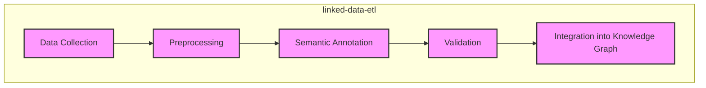
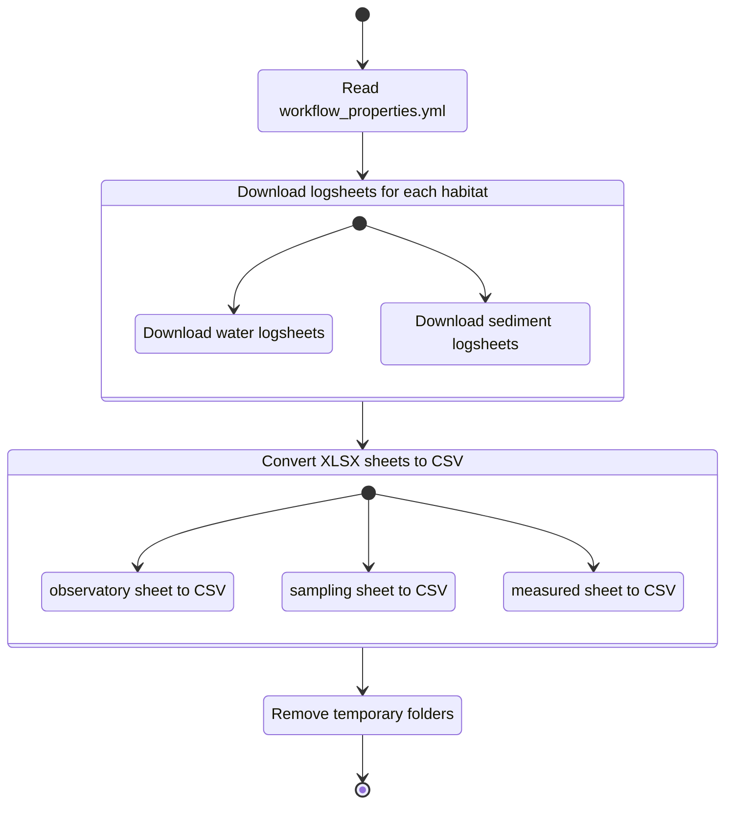
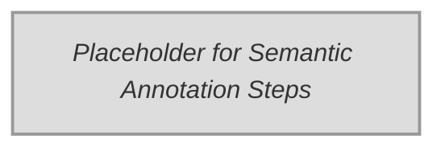
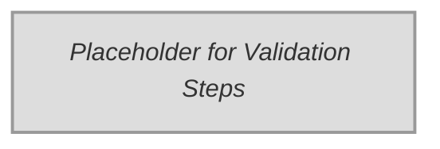
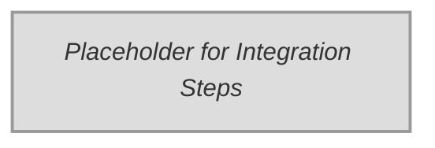

This section will provide a visual guide to navigating the EMO-BON data workflow and systems.

:::{note}
A graphical navigation guide will be added here to help users understand the overall structure and flow of the EMO-BON data systems.
:::

## Semantic Uplifting Process

### Overview Diagram

### Description

This diagram illustrates the semantic uplifting process inspired by the `linked-data-etl` workflow. Key steps include:

1. **Data Collection**: Gathering raw data from various sources.
2. **Preprocessing**: Cleaning and preparing data for semantic annotation.
3. **Semantic Annotation**: Enriching data with semantic metadata using tools like `semantify`.
4. **Validation**: Ensuring data quality and adherence to profiles (e.g., RO-Crate profiles).
5. **Integration into Knowledge Graph**: Aggregating and publishing validated data into a knowledge graph for further use.

This process ensures data is transformed into a semantically rich and interoperable format, ready for integration into broader systems.

#### Sub-process: Data Collection

#### Sub-process: Semantic Annotation

#### Sub-process: Validation

#### Sub-process: Integration into Knowledge Graph

## Coming Soon

This section is under development and will include:

- System architecture diagrams
- Data flow visualizations
- Navigation maps for different user roles
- Quick reference guides