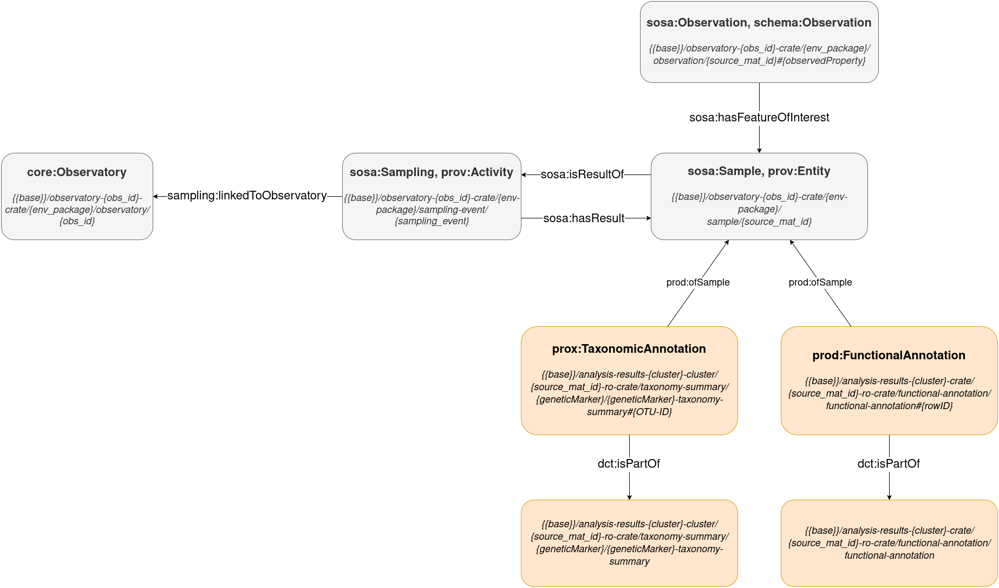

> Analysis Results Entity Diagram
> 

### Taxonomy Annotation

Taxonomic annotation results from sequence analysis.

- **Class:**  
`prod:TaxonomicAnnotation`
- **Relationships**:
  - Taxonomic annotation → `prod:ofSample` → Sample
  - Taxonomic annotation → `dct:isPartOf` → Taxonomy Annotation collection
- **URI Pattern**:  
`{{base}}/analysis-results-{cluster}-crate/{source_mat_id}-ro-crate/taxonomy-summary/{geneticMarker}/{geneticMarker}-taxonomy-summary#{OTU-ID}`  
Example:  
[https://data.emobon.embrc.eu/analysis-results-cluster-01-crate/EMOBON_AAOT_Wa_42-ro-crate/taxonomy-summary/SSU/SSU-taxonomy-summary#2157](https://s3.mesocentre.uca.fr/mgf-data-products/files/md5/f5/c7a71924e1cfb10410331f27636b52)

### Taxonomy Annotation Collection

Collection of taxonomy annotations

- **URI Pattern**:  
`{{base}}/analysis-results-{cluster}-crate/{source_mat_id}-ro-crate/taxonomy-summary/{geneticMarker}/{geneticMarker}-taxonomy-summary`  
Example:  
- [https://data.emobon.embrc.eu/analysis-results-cluster-01-crate/EMOBON_AAOT_Wa_42-ro-crate/taxonomy-summary/SSU/SSU-taxonomy-summary](https://s3.mesocentre.uca.fr/mgf-data-products/files/md5/f5/c7a71924e1cfb10410331f27636b52)

### Functional Annotation

Functional annotation results from sequence analysis.

- **Class:**  
`prod:FunctionalAnnotation` 
- **Relationships**:
  - Functional annotation → `prod:ofSample` → Sample
  - Functional annotation → `dct:isPartOf` → Functional Annotation collection
- **URI Pattern**:  
`{{base}}/analysis-results-{cluster}-crate/{source_mat_id}-ro-crate/functional-annotation/functional-annotation#{rowID}`  
Example:  
[https://data.emobon.embrc.eu/analysis-results-cluster-01-crate/EMOBON_AAOT_Wa_42-ro-crate/functional-annotation/functional-annotation#GO:0055085](https://s3.mesocentre.uca.fr/mgf-data-products/files/md5/9f/0b9bb0f1f867f954f27cc05900879c)

### Functional Annotation Collection

Collection of functional annotations

- **URI Pattern**:  
`{{base}}/analysis-results-{cluster}-crate/{source_mat_id}-ro-crate/functional-annotation/functional-annotation`  
Example:  
[https://data.emobon.embrc.eu/analysis-results-cluster-01-crate/EMOBON_AAOT_Wa_42-ro-crate/functional-annotation/functional-annotation](https://s3.mesocentre.uca.fr/mgf-data-products/files/md5/9f/0b9bb0f1f867f954f27cc05900879c)

## *Sequencing Entities - TBD*

### *Batch*

...

**URI Pattern**:  
`...`

### *Sequence Run*

Details of a sequencing run.

**URI Pattern**:  
`....`
