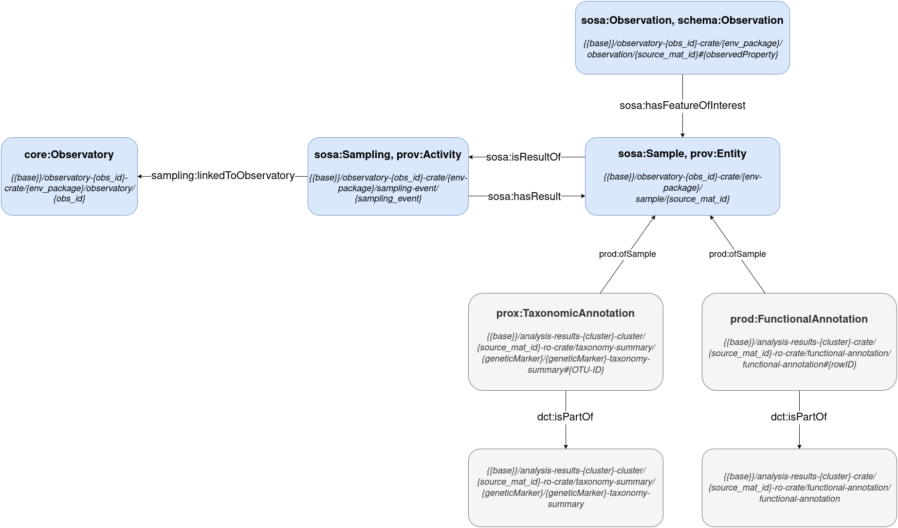

The Turtle files found in the EMO-BON crates are harvested and aggregated into a triple store, forming **a large, interconnected knowledge graph of EMO-BON data**.

> Core Entities Diagram
> 

### Observatory

An EMO-BON organizational unit linked to the collection of a specific sample type (e.g., water column, soft sediment) from a fixed, pre-determined location.
- **Class**  
`core:Observatory`
- **URI Pattern**:  
`{{base}}/observatory-{obs_id}-crate/{env_package}/observatory/{obs_id}`  
Example: http://data.emobon.embrc.eu/observatory-bpns-crate/sediment/observatory/BPNS 

### Sampling Event

A sampling action performed at a particular observatory at a specific time, resulting in the collection of one or more samples.

- **Class:**  
`sosa:Sampling`, `prov:Activity`
- **Relationships**:
    - Sampling event → `sampling:linkedToObservatory` → Observatory
    - Sampling event → `sosa:hasResult` → Sample(s)
- **URI Pattern**:  
`{{base}}/observatory-{obs_id}-crate/{env_package}/sampling-event/{sampling_event}`  
Example: http://data.emobon.embrc.eu/observatory-bpns-crate/sediment/sampling-event/BPNS_So_210701 

### Sample (Material Sample)

A material sample collected during a sampling event. Each unique material sample has a unique material sample ID.

- **Class:**  
`sosa:Sample`, `prov:Activity`
- **Relationships**:
  - Sample → `sosa:isResultOf` → Sampling Event
- **URI Pattern**:  
`{{base}}/observatory-{obs_id}-crate/{env_package}/sample/{source_mat_id}`  
Example: http://data.emobon.embrc.eu/observatory-bpns-crate/sediment/sample/EMOBON_BPNS_So_1

- ### Observation

A measurement or observation made on a sample.

- **Class:**  
`sosa:Observation`, `schema:Observation`
- **Relationships**:
  - Observation → `sosa:hasFeatureOfInterest` → Sample
- **URI Pattern**:  
`{{base}}/observatory-{obs_id}-crate/{env_package}/observation/{source_mat_id}#{observedProperty}`  
Example: http://data.emobon.embrc.eu/observatory-bpns-crate/sediment/observation/EMOBON_BPNS_So_1