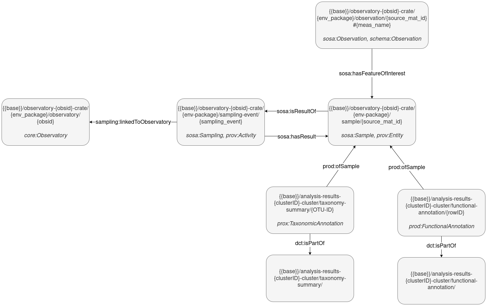

This section describes the key entities in the EMO-BON knowledge graph and their relationships.

## Entity Relationship Diagram

:::{Entity diagram}

:::

## Core Entities

*Graph objects resulting from the semantic uplifting of the sampling logsheet data*

### Observatory

An EMO-BON organizational unit linked to the collection of a specific sample type (e.g., water column, soft sediment) from a fixed, pre-determined location.

- **URI Pattern**:  
`/observatory-{obs_id}-crate/{env_package}/observatory/{obs_id}`

- **Class**  
`core:Observatory`

### Sampling Event

A sampling action performed at a particular observatory at a specific time, resulting in the collection of one or more samples.

- **URI Pattern**:  
`/observatory-{obs_id}-crate/{env_package}/sampling-event/{sampling_event}`

- **Class:**  
`sosa:Sampling`, `prov:Activity`

- **Relationships**:
    - Sampling event → `sampling:linkedToObservatory` → Observatory
    - Sampling event → `sosa:hasResult` → Sample(s)

### Sample (Material Sample)

A material sample collected during a sampling event. Each unique material sample has a unique material sample ID.

- **URI Pattern**:  
`/observatory-{obs_id}-crate/{env_package}/sample/{source_mat_id}`

- **Class:**  
`sosa:Sample`, `prov:Activity`

- **Relationships**:
  - Sample → `sosa:isResultOf` → Sampling Event

- ### Observation

A measurement or observation made on a sample.

- **URI Pattern**:  
`/observatory-{obs_id}-crate/{env_package}/observation/{source_mat_id}#{observedProperty}`

- **Class:**  
`sosa:Observation`, `schema:Observation`

- **Relationships**:
  - Observation → `sosa:hasFeatureOfInterest` → Sample

## Analysis Result Entities

*Graph entities resulting from the semantic uplifting of the analysis results data*

### Taxonomy Annotation

Taxonomic annotation results from sequence analysis.

- **URI Pattern**:  
`/analysis-results-{cluster}-crate/taxonomy-summary#{OTU-ID}`

- **Class:**  
`prod:TaxonomicAnnotation`

- **Relationships**:
  - Taxonomic annotation → `prod:ofSample` → Sample
  - Taxonomic annotation → `dct:isPartOf` → Taxonomy Summary collection

### Taxonomy Annotation Collection

Collection of taxonomy annotations

- **URI Pattern**:  
`/analysis-results-{cluster}-crate/taxonomy-summary`

### Functional Annotation

Functional annotation results from sequence analysis.

- **URI Pattern**:  
`/analysis-results-{cluster}-crate/functional-annotation#{rowID}`

- **Class:**  
`prod:FunctionalAnnotation` 

- **Relationships**:
  - Functional annotation → `prod:ofSample` → Sample
  - Functional annotation → `dct:isPartOf` → Functional Annotation collection

### Functional Annotation Collection

Collection of functional annotations

- **URI Pattern**:  
`/analysis-results-{cluster}-crate/functional-annotation`

## *Sequencing Entities - TBD*

### *Batch*

...

**URI Pattern**:  
`...`

### *Sequence Run*

Details of a sequencing run.

**URI Pattern**:  
`....`
