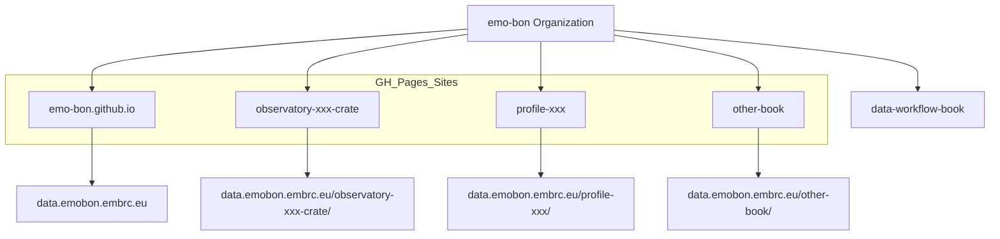

This section describes how EMO-BON data and documentation are published.

## W3ID.org Persistent Identifiers

EMO-BON uses W3ID.org for persistent identifiers.

**Purpose**: Provide stable, long-term URIs that won't break if hosting infrastructure changes.

**Usage**: 

**Example**: `https://w3id.org/emobon/` may redirect to `https://data.emobon.embrc.eu/`

## GitHub Pages

EMO-BON uses GitHub Pages for publishing static content.

### Main Website

**Repository**: emo-bon.github.io

**URL**: https://data.emobon.embrc.eu/

**Purpose**: Central entry point for EMO-BON data

**Content**:

**Custom Domain**: Configured via CNAME file to use `data.emobon.embrc.eu`

### Observatory Crate Sites

**Pattern**: `observatory-{obsid}-crate` → `https://data.emobon.embrc.eu/observatory-{obsid}-crate/`

**Purpose**: Human-readable views of observatory data

**Content**:

### Profile Sites

**Pattern**: `{name}-profile` → `https://data.emobon.embrc.eu/{name}-profile/`

**Purpose**: Documentation of RO-Crate profiles

**Content**:

### Documentation Books

**Pattern**: `{name}-book` → `https://data.emobon.embrc.eu/{name}-book/`

**Purpose**: Comprehensive documentation (like this book)

**Technology**: MyST Markdown (formerly Jekyll/GitBook)

## GitHub Repository Structure

All EMO-BON repositories follow consistent patterns:

### Public Repositories

All EMO-BON repositories are public by default to support open science principles.

### Repository Naming

See the [Conventions](../08-addendum/conventions.md) section for naming guidelines.

### Repository Types


## Publishing Workflow

### Automated Publishing

1. **Data Changes**: Logsheet updates trigger workflow
2. **Processing**: GitHub Actions process data
3. **Generation**: RO-Crate and HTML generated
4. **Deployment**: Pushed to gh-pages branch
5. **Publication**: GitHub Pages serves updated content

### Manual Publishing

For documentation and profiles:
1. **Edit**: Make changes in main branch
2. **Review**: Pull request review process
3. **Merge**: Merge to main
4. **Build**: GitHub Actions build site
5. **Deploy**: Deployed to GitHub Pages

## Custom Domain Configuration

EMO-BON uses the custom domain `data.emobon.embrc.eu`:

1. **CNAME File**: Each repository has a CNAME file in the root
2. **DNS Configuration**: EMBRC manages DNS settings
3. **GitHub Configuration**: Repository settings point to custom domain
4. **HTTPS**: Automatic HTTPS via GitHub Pages

## Content Delivery

### Static Files


### Data Files


### API Endpoints


## Versioning and Archival

### Git Versioning


### DOIs

EMO-BON datasets may receive DOIs for citation:

### Long-term Preservation

# Publication Details

## Overview

This document provides an overview and detailed description of all publication endpoints managed by the emo-bon organization, including GitHub Pages sites and W3ID.org redirects. It is structured to support future additions of other publication mechanisms.

### Current Publication Endpoints

- GitHub Pages sites (across emo-bon organization)
- W3ID.org redirects
- [Placeholder] Other endpoints (to be added)

---

## Mermaid Diagram: Publication Endpoints



---

## Details

### GitHub Pages Publications

Below is a list of current GitHub Pages sites published by the emo-bon organization. Each site serves a specific purpose within the EMO-BON data workflow and documentation ecosystem.

#### Main Website
- **Repository:** [emo-bon.github.io](https://github.com/emo-bon/emo-bon.github.io)
- **URL:** [https://data.emobon.embrc.eu/](https://data.emobon.embrc.eu/)
- **Purpose:** Central entry point for EMO-BON data, documentation, and project information.

#### Observatory Crate Sites
- **Pattern:** `observatory-{obsid}-crate` (e.g., [observatory-abc-crate](https://github.com/emo-bon/observatory-abc-crate))
- **URL:** `https://data.emobon.embrc.eu/observatory-{obsid}-crate/`
- **Purpose:** Human-readable views of observatory data, including sample listings, events, and downloadable files.

#### Profile Sites
- **Pattern:** `{name}-profile` (e.g., [analysis-profile](https://github.com/emo-bon/analysis-profile))
- **URL:** `https://data.emobon.embrc.eu/{name}-profile/`
- **Purpose:** Documentation of RO-Crate profiles, including specifications and semantic templates.

#### Documentation Books
- **Pattern:** `{name}-book` (e.g., [data-workflow-book](https://github.com/emo-bon/data-workflow-book))
- **URL:** `https://data.emobon.embrc.eu/{name}-book/`
- **Purpose:** Comprehensive documentation, technical details, and best practices.

#### Other Sites
- [Placeholder for future GitHub Pages publications]

### W3ID.org

W3ID.org is a community-driven service for providing persistent, reliable URIs for web resources, especially in the context of linked data and semantic web projects. See [w3id.org](https://w3id.org/) for more information.

#### Purpose
- Ensures long-term stability of URIs, even if hosting infrastructure changes
- Used for ontology namespaces, profile URIs, and key entity identifiers in EMO-BON

#### EMO-BON Implementation
- EMO-BON maintains its W3ID configuration at: [emo-bon/w3id.org](https://github.com/emo-bon/w3id.org/tree/master/emo-bon)
- Each path under `https://w3id.org/emobon/` is mapped to the appropriate resource or documentation
- Redirection is managed via an `.htaccess` file in the repository

##### Example .htaccess logic
```apache
RewriteEngine On
RewriteRule ^emobon/(.*)$ https://data.emobon.embrc.eu/$1 [R=302,L]
```
This rule redirects requests from `https://w3id.org/emobon/...` to the corresponding path at `https://data.emobon.embrc.eu/...`.

For more details, see the [emo-bon w3id.org repo](https://github.com/emo-bon/w3id.org/tree/master/emo-bon).

### Other Publication Endpoints

This section is reserved for future publication endpoints. If new mechanisms or platforms are adopted, documentation will be added here.
